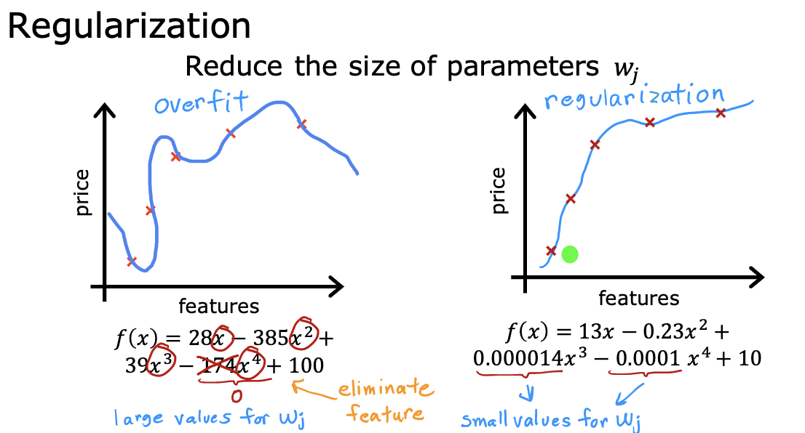

# Supervised Machine Learning

- [Supervised Machine Learning](#supervised-machine-learning)
  - [Week 1: Intro to ML](#week-1-intro-to-ml)
    - [What is ML?](#what-is-ml)
    - [Supervised vs Unsupervised](#supervised-vs-unsupervised)
    - [Regression model](#regression-model)
      - [Linear Regression](#linear-regression)
    - [cost function](#cost-function)
    - [Gradient descent](#gradient-descent)
  - [Week 2: Regression with multiple input variables](#week-2-regression-with-multiple-input-variables)
    - [GD with multiple variables](#gd-with-multiple-variables)
    - [feature scaling](#feature-scaling)
    - [checking gradient descent for convergence](#checking-gradient-descent-for-convergence)
    - [choosing learning rate](#choosing-learning-rate)
  - [Week 3: Classification](#week-3-classification)
    - [Logistic regression](#logistic-regression)
    - [sigmoid function](#sigmoid-function)
    - [Convex vs non-convex](#convex-vs-non-convex)
    - [Cost function](#cost-function-1)
    - [Underfitting & Overfitting](#underfitting--overfitting)
      - [solutions](#solutions)
    - [Regularization](#regularization)
    - [Gradient descent for Logistic Regression](#gradient-descent-for-logistic-regression)

## Week 1: Intro to ML

### What is ML?

Arthur Samuel - "Machine Learning is the field of study that gives computers the ability to learn without being explicitly programmed."

### Supervised vs Unsupervised

99 % of the economic value created by machine learning today is through supervised learning.

Supervised Learning

- algorithims that learns x to y or input to output mappings.
- give learning algorithms examples to learn from, which includes the right answers (correct label y for given input x). Algorithm looks at the correct pairs of input x and desired label y, learns to take input and give reasonable accurate prediction of the output.
- examples:
  - spam filtering - email -> spam?
  - speech recognition - audio -> text transcript
  - machine translation - English -> Chinese
  - online ads - ad, user info -> click?
  - self-driving - image, radar info -> position of other cars
  - visual insnpection - image -> defect?
- Types:
  - Regression: Predicts numbers
  - Classifcation: Predict small number of categories/classes

Unsupervised Learning

- algorithms that find spatterns/structure in data with only inputs x but not output label y
- Types:
  - clustering : groups similar data points together
  - anomaly detection : detect unusual events
  - dimensionality reduction : compress big data-set into smaller data-set while losing as little info as possible

### Regression model

#### Linear Regression

x = input variable \
y = output variable \
m = number of training examples \
$(x, y)$ = single training example \
$x^{(i)}, y^{(i)}$ = ith training example

x -> f -> $\hat{y}$

representing f for linear regression

$\hat{y}^{(i)} = f_{w, b}(x^{(i)})$

$f_{w, b}(x) = w * x + b$

To train a linear regression model, you find the best parameters w and b. What determines the it as the best?

### cost function

We evaluate models by the cost (error)

$J(w, b) = \frac{1}{2m} \sum^{m}_{i=1}{(\hat{y}^{(i)} - y{(i)})^2}$

cost = $(\hat{y} - y)^2$

The best choice of (w, b) that fits data the best is the one with the lowest cost.

How to find it? An algorithm that figures out the minimum point in the cost function. (parabola with just one parameter, soup bowl with two parameter)

### Gradient descent

- soup bowl, algorithm that finds the global minimum

You have a cost function that computes cost based on w and b values, now you need a way to update w and b to minimize cost function. How? with calculus.

1. set initial parameters w, b, learning rate
2. calculate gradient and update parameters (w, b)
3. compute cost
4. repeat steps 2 and 3 until cost is minimum / convergence

in this case, convergence = small or no change

## Week 2: Regression with multiple input variables

$$ f_{\mathbf{w},b}(\mathbf{x}) =  w_0x_0 + w_1x_1 +... + w_{n-1}x_{n-1} + b$$
or in vector notation:
$$ f_{\mathbf{w},b}(\mathbf{x}) = \mathbf{w} \cdot \mathbf{x} + b  $$

where $\cdot$ is a vector `dot product`

The equation for the cost function with multiple variables $J(\mathbf{w},b)$ is:

$$J(\mathbf{w},b) = \frac{1}{2m} \sum\limits_{i = 0}^{m-1} (f_{\mathbf{w},b}(\mathbf{x}^{(i)}) - y^{(i)})^2$$

where:
$$ f_{\mathbf{w},b}(\mathbf{x}^{(i)}) = \mathbf{w} \cdot \mathbf{x}^{(i)} + b  $$

w and x are now vectors

### GD with multiple variables

$$
\begin{align*} \text{repeat}&\text{ until convergence:} \; \lbrace \newline\;
& w_j := w_j -  \alpha \frac{\partial J(\mathbf{w},b)}{\partial w_j}  \; & \text{for j = 0..n-1}\newline
&b\ \ := b -  \alpha \frac{\partial J(\mathbf{w},b)}{\partial b}  \newline \rbrace
\end{align*}
$$

$$
\begin{align*}
\frac{\partial J(\mathbf{w},b)}{\partial w_j}  &= \frac{1}{m} \sum\limits_{i = 0}^{m-1} (f_{\mathbf{w},b}(\mathbf{x}^{(i)}) - y^{(i)})x_{j}^{(i)} \newline
\frac{\partial J(\mathbf{w},b)}{\partial b}  &= \frac{1}{m} \sum\limits_{i = 0}^{m-1} (f_{\mathbf{w},b}(\mathbf{x}^{(i)}) - y^{(i)})
\end{align*}
$$

### feature scaling

some features can be 2-3 magnitudes larger - size of house squared feet vs no of houses.

This causes the larger features to reduce faster than others.

3 methods for feature scaling

1. Common (rescales to -1 to 1 range)
   1. divide by max (only works for positive features)
   2. minmax $\frac{x - min}{max - min}$
2. Mean normalization: $x_i := \dfrac{x_i - \mu_i}{max - min}$
3. Z-score normalization :

$$x^{(i)}_j = \dfrac{x^{(i)}_j - \mu_j}{\sigma_j}$$
where $j$ selects a feature or a column in the $\mathbf{X}$ matrix. $µ_j$ is the mean of all the values for feature (j) and $\sigma_j$ is the standard deviation of feature (j).

$$
\begin{align*}
\mu_j &= \frac{1}{m} \sum_{i=0}^{m-1} x^{(i)}_j\\
\sigma^2_j &= \frac{1}{m} \sum_{i=0}^{m-1} (x^{(i)}_j - \mu_j)^2
\end{align*}
$$

### checking gradient descent for convergence

Automatic epsilon test (ex: $\epsilon =  0.001$) if in one iteration $J(W, b)$ decreases by $\leq \epsilon$, we declare convergence

### choosing learning rate

if cost is increasing with ur learning rate, gradient descent is diverging, so choose a lower learning rate.

## Week 3: Classification

### Logistic regression

Goal: Classification, returns value between 0 or 1 using the sigmoid function

Outputs are probabilities which tells us which class to output. Common threshold is 0.5 which serves as the decision boundary.

You can also have non-linear boundaries

### sigmoid function

- if z is large negative, g(z) will be 1/(large number), so near 0
- if z is large positive, g(z) will be 1/(close to 1), so near 1

### Convex vs non-convex

under squared error cost, logistic regression is non-convex which means it cannot reach a global minimum due existence of many local minimum.

Let's find a convex cost function more suitable for the non-linear nature of Logistic regression

### Cost function

- **Loss** is a measure of the difference of a single example to its target value  
- **Cost** is a measure of the losses over the training set

$loss(f_{\mathbf{w},b}(\mathbf{x}^{(i)}), y^{(i)})$ is the cost for a single data point, which is:

$$
\begin{equation*}
  loss(f_{\mathbf{w},b}(\mathbf{x}^{(i)}), y^{(i)}) = \begin{cases}
    - \log\left(f_{\mathbf{w},b}\left( \mathbf{x}^{(i)} \right) \right) & \text{if $y^{(i)}=1$}\\
    - \log \left( 1 - f_{\mathbf{w},b}\left( \mathbf{x}^{(i)} \right) \right) & \text{if $y^{(i)}=0$}
  \end{cases}
\end{equation*}
$$

- $f_{\mathbf{w},b}(\mathbf{x}^{(i)}) = g(\mathbf{w} \cdot\mathbf{x}^{(i)}+b)$ where function $g$ is the sigmoid function.

simplified cost function

$$loss(f_{\mathbf{w},b}(\mathbf{x}^{(i)}), y^{(i)}) = (-y^{(i)} \log\left(f_{\mathbf{w},b}\left( \mathbf{x}^{(i)} \right) \right) - \left( 1 - y^{(i)}\right) \log \left( 1 - f_{\mathbf{w},b}\left( \mathbf{x}^{(i)} \right) \right)$$

How was this cost function obtained and why this particular cost function? It was solved with Maximum Likelihood Estimation (MLE), which effeciently finds parameters for different models

### Underfitting & Overfitting

Underfit - high bias\
Overfit - high variance

#### solutions

Overfitting

1. collect more data
2. select features
3. reduce size of parameters
   1. regularization (commonly only regularize B and not w)

Underfitting solutions

1. collect more data
2. increase size/no. of parameters
3. increase complexity of model
4. increase training time to minimize cost function

### Regularization

The equation for the cost function regularized regression is:
$$J(\mathbf{w},b) = \frac{1}{2m} \sum\limits_{i = 0}^{m-1} (f_{\mathbf{w},b}(\mathbf{x}^{(i)}) - y^{(i)})^2  + \frac{\lambda}{2m}  \sum_{j=0}^{n-1} w_j^2 \tag{1}$$ 

Linear regression:
$$ f_{\mathbf{w},b}(\mathbf{x}^{(i)}) = \mathbf{w} \cdot \mathbf{x}^{(i)} + b  $$ 

Logistic regression:
$$ f_{\mathbf{w},b}(\mathbf{x}^{(i)}) = sigmoid(\mathbf{w} \cdot \mathbf{x}^{(i)} + b) $$

### Gradient descent for Logistic Regression

